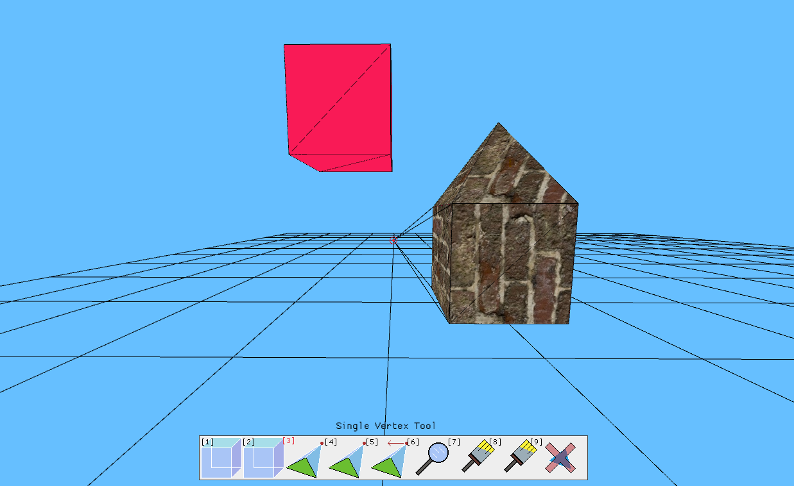

# sculpt-rs: 3D-modelling made as easy as possible
A basic 3D-modelling application built with rust and macroquad, that is usable in a browser through web assembly. Currently in very early stages of development. 

Currently has:
- Place cubes and quads/triangles
- Extend your models using the single vertex tool
- Change vertex locations
- Paint on models using either the pixel or material brush

Try out a basic version [here](amieleg.github.io)
